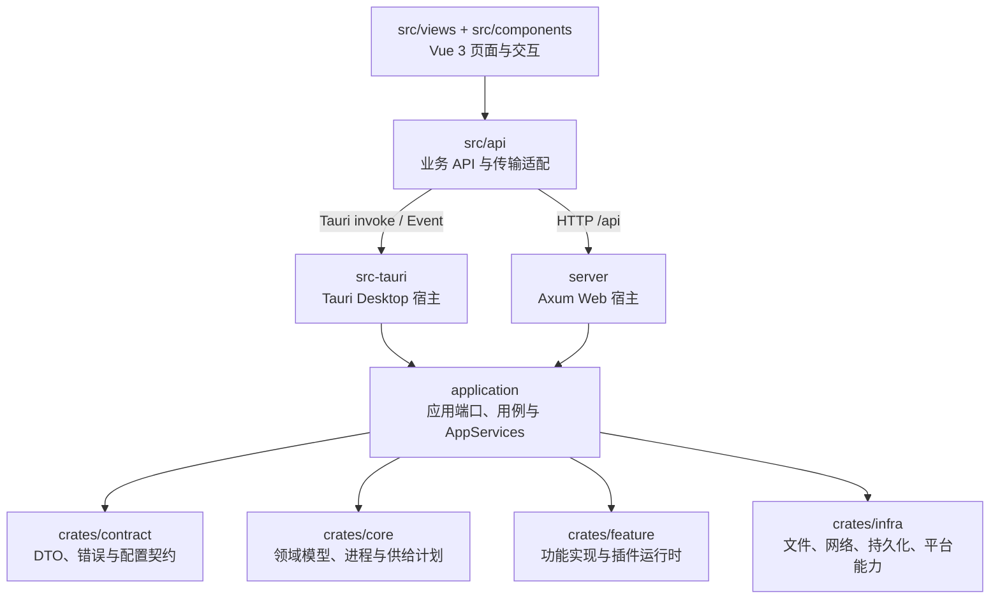

# 当前架构与代码组织

本文描述当前仓库的实际代码边界，以及已采纳的 RESTful RPC 方向。它是给贡献者阅读源码和定位新功能的入口，不是迁移草案；实现发生变化时，应在同一变更中更新本文和对应设计文档。

## 运行拓扑



前端传输仍处于逐步收敛状态：`src/api/invoke.ts` 为已经接通的业务提供 Tauri 与 Axum 双模式分发，`src/api/tauri.ts` 仍承载一部分 Desktop-only 或尚未接通 Web 的旧包装器。浏览器模式遇到未注册的 Axum 路由会得到 `NotImplementedError`，不能把所有 `src/api` 方法都当成 Web 可用。

## Workspace 分层

| 路径              | 当前职责                                                                                                    | 不应放入的内容                                  |
| ----------------- | ----------------------------------------------------------------------------------------------------------- | ----------------------------------------------- |
| `application`     | `application/src/port` 定义服务端口，`application/src/service` 实现用例，`AppServices` 提供显式共享服务句柄 | Tauri command、Axum request 解析、Vue 逻辑      |
| `crates/contract` | 跨宿主共享的 DTO、事件、可序列化错误和配置模型；不依赖项目实现层                                            | 服务 trait、路由注册、RPC handler、宿主生命周期 |
| `crates/core`     | 实例模型、生命周期、进程/终端、服务器检测和供给计划，以及插件能力与策略的传输无关类型                       | 宿主状态、HTTP/Tauri 类型                       |
| `crates/feature`  | 备份、配置、Java、市场、在线隧道、更新、日志和 Lua 插件 loader/manager/engine                               | 宿主传输入口和公共服务端口                      |
| `crates/infra`    | 文件系统、归档、下载、网络、代理、持久化和平台适配                                                          | 业务用例和前端协议                              |
| `src-tauri`       | Desktop 进程入口、Tauri command/event、窗口、托盘、轻量模式和桌面文件/进程能力                              | Web server 实现                                 |
| `server`          | Web 进程入口、单一 Axum RESTful API、插件 RPC、Vite dev/static SPA 组装和监听生命周期                       | Desktop 窗口与 Tauri 状态                       |
| `crates/vendor`   | 独立许可的 vendored crate，例如 `java-manager` 和 `sysproxy`                                                | 项目公共领域规则                                |

`application::port` 是能力契约，`AppServices` 是由 composition root 创建并显式传入宿主状态的服务聚合句柄，二者都不属于 `contract`。`contract` 只拥有跨宿主传输所需的数据和错误形状；需要 `core` 领域对象或功能实现的服务 trait 放在 `application/src/port`，由应用实现完成转换和错误收敛。业务实现和适配器不得通过隐式全局 locator 获取服务。宿主退出前必须调用 `AppServices::shutdown()`，停止 Cron、系统代理监控和在线隧道；不能依赖丢弃句柄回收后台任务。

## 依赖与调用边界

当前主依赖方向是：

```text
src-tauri / server ───────► application ───────► core
       │                         │                 ▲
       ├────────────────────────► contract         │
       │                         ├──────────────► feature
       │                         └──────────────► infra
       └──────────────────────────────────────────► contract

application::port ─────────────► contract + core
feature ───────────────────────► contract + core + infra
infra ─────────────────────────► contract
contract ──────────────────────► no project implementation crate
```

必须保持的边界：

1. `src-tauri` 和 `server` 互不依赖；共享业务通过 `application`、`contract` 和既有领域 crate 复用。
2. `application` 不依赖 Tauri、Axum 或 Vue；宿主差异在适配器中处理。
3. `core`、`feature`、`infra` 不接收 Tauri command 参数或 Axum request。
4. 普通业务遵守 [RESTful RPC 设计](./RESTful-RPC-Design.md)，不扩展成覆盖所有业务的 `method_id + JSON` runtime。
5. 插件能力可以使用显式的插件 RPC/Bridge；这不等于把普通业务改造成通用 RPC。
6. `feature` 的功能实现可以依赖 `contract` 模型，但 `contract` 不得反向依赖 `feature`。

已知的边界缺口要写成明确状态，不通过文档假装已经完成：普通业务的 generic RPC 注册器和前端旧 RPC 文件仍待清理；前端双宿主映射也尚未覆盖所有旧 API。插件的详细授权与运行时边界见[插件设计](./plugin.md)。

## 宿主入口

### Desktop

`src-tauri/src/main.rs` 创建 Tauri builder，注册 `src-tauri/src/adapter/tauri/commands` 下的命令，在 `setup` 中调用 `AppServices::build()` 并通过 Tauri `State` 管理服务句柄，然后设置窗口、托盘、日志转发和退出清理。退出时先停止事件/日志转发，再调用 `AppServices::shutdown()` 收敛应用后台服务。桌面专用的文件选择、窗口材质、轻量模式和本地事件留在 `src-tauri/src/desktop` 或对应 adapter 中。

### Web

`server/src/main.rs` 调用 `AppServices::build()`，将返回的句柄显式传入 `AppState`，再构建 Vite 配置并启动 Axum。服务正常退出或监听服务出错前都会调用 `AppServices::shutdown()`。它只创建一个 `TcpListener`；`server/src/adapter/http/router.rs` 是生产路由入口，将普通业务 RESTful API、插件 v2 RPC 和 SPA 路由组装在同一个 Axum 应用中。

普通业务当前路由族包括实例与服务器生命周期、供给检查、设置、系统资源、定时任务、更新和下载；插件能力调用是单独的 `/api/rpc/plugin/v2/invoke` RPC 路由，并有自己的 Bearer 认证边界。`server/src/rpc/router.rs` 的通用 RPC 注册器是迁移残留，目前仅由自身测试使用，没有第二个监听入口。

默认 Web 监听地址是 `127.0.0.1:3000`。`SEALANTERN_SERVER_ADDR` 可完全覆盖地址，`SEALANTERN_SERVER_BIND_PUBLIC=1` 或 `true` 才会改变默认绑定策略。

## 新功能落位

### 共享业务

1. 在 `crates/contract` 复用或补充宿主共用的输入、输出、事件和错误 DTO。
2. 在 `application/src/port` 定义服务能力端口，在 `application/src/service` 实现用例，并在 `application/src/services.rs` 装配 `AppServices`；由宿主 composition root 创建一次后显式传入适配器状态。
3. 在 Desktop 和 Web 各自添加薄适配器，只负责传输和宿主上下文。
4. 在 `src/api` 暴露业务方法；只有已经有 Web 路由的能力才增加双模式映射。
5. 为端口实现、宿主适配器和路由契约分别补充针对边界的测试。

### 宿主专用能力

窗口、托盘、文件对话框、原生进程能力和 Tauri 事件留在 Desktop；HTTP 监听、SPA/Vite 生命周期和 Web 认证留在 Web。不要为了目录对称而为另一宿主制造没有实际消费者的实现。

## 源码锚点

- [workspace Cargo.toml](../../Cargo.toml)
- [application ports](../../application/src/port)
- [application service assembly](../../application/src/services.rs)
- [Desktop entry](../../src-tauri/src/main.rs)
- [Web entry](../../server/src/main.rs)
- [Web router](../../server/src/adapter/http/router.rs)
- [RESTful RPC design](./RESTful-RPC-Design.md)
- [dual-transport frontend adapter](../../src/api/invoke.ts)
